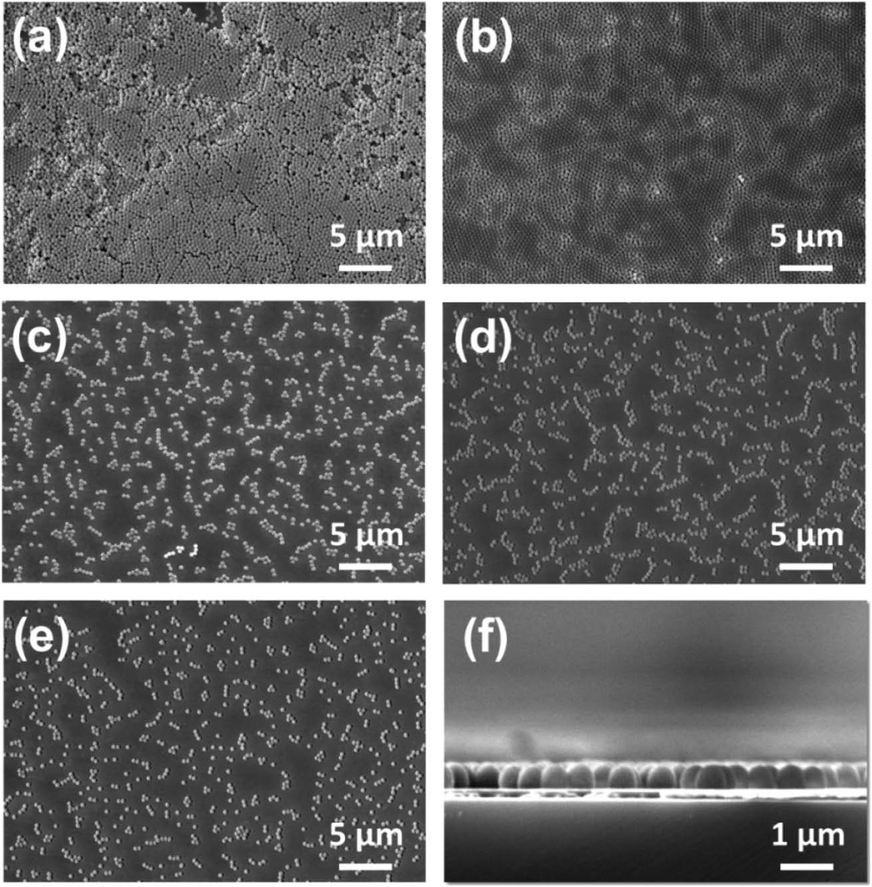
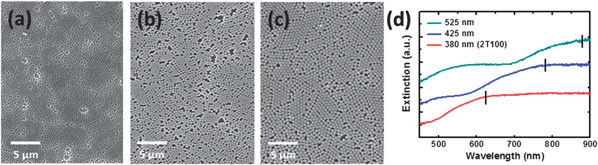
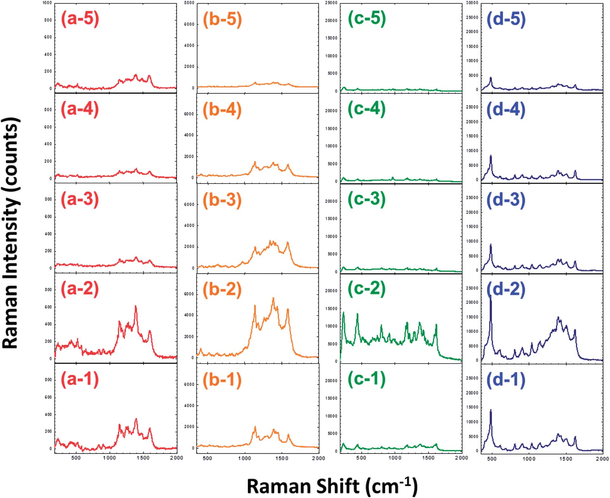
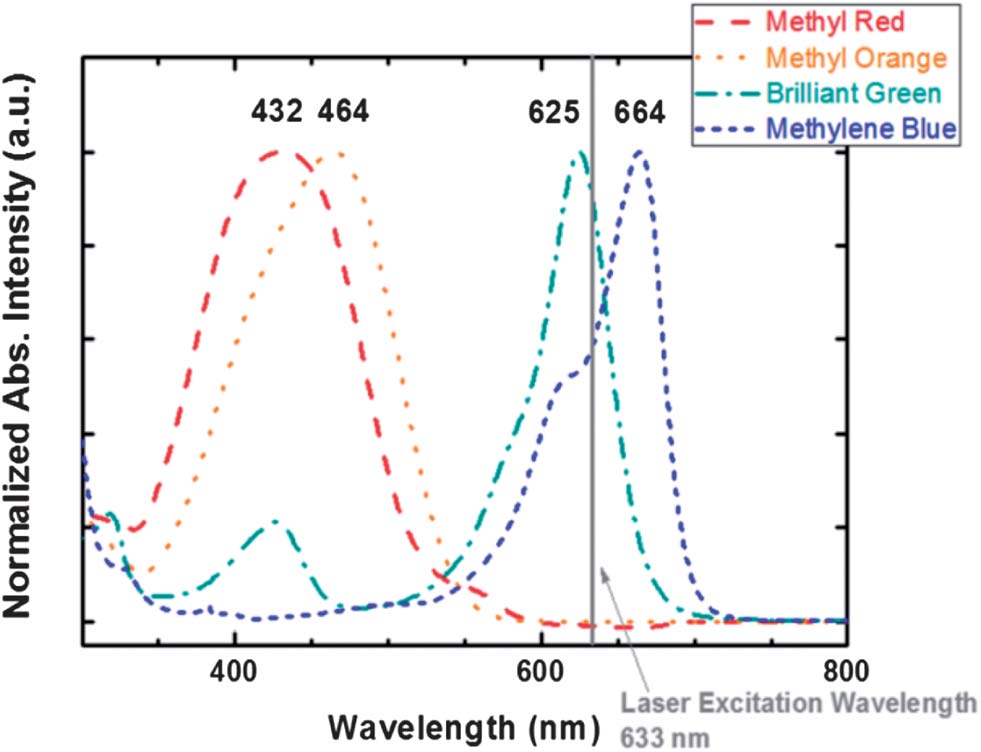
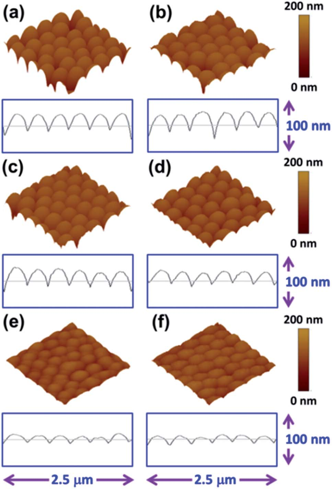
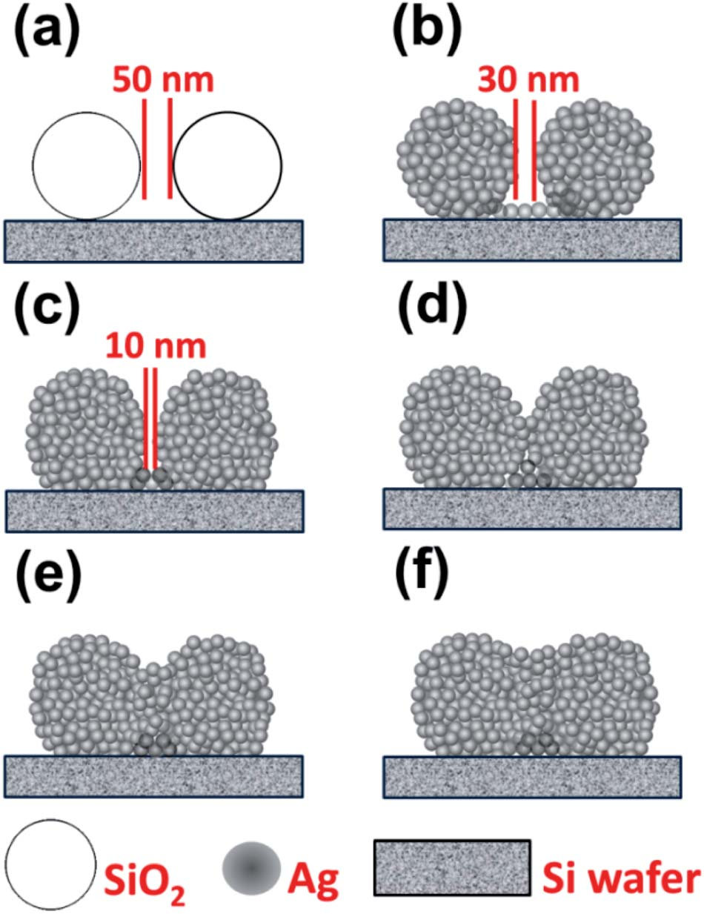
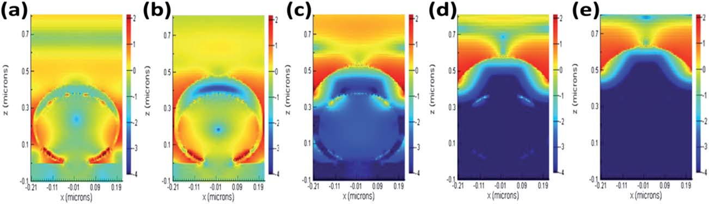
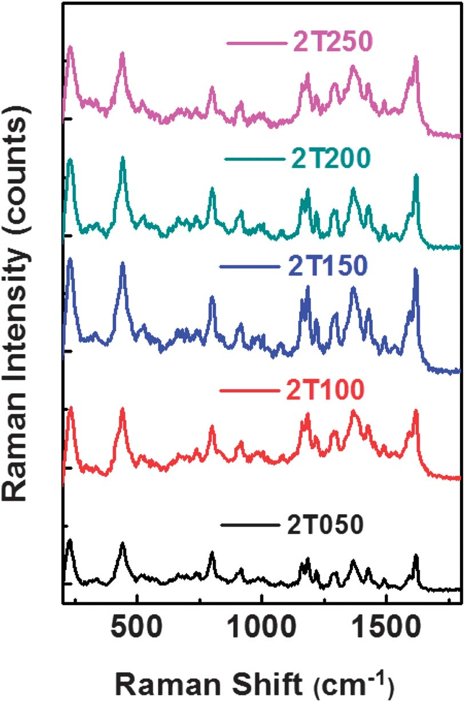
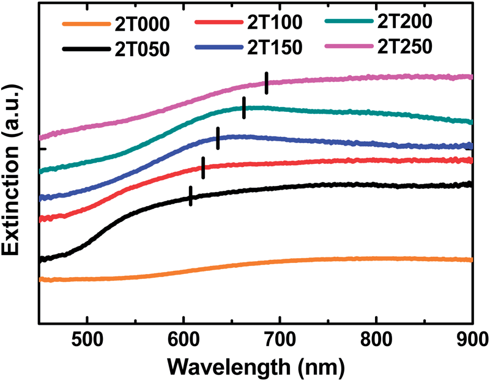
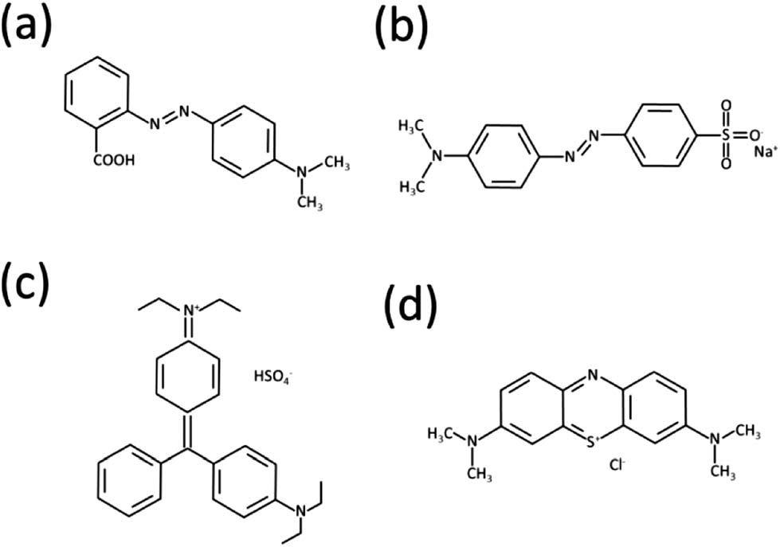

# Surface-enhanced Raman scattering substrate based on a Ag coated monolayer array of SiO2 spheres for organic dye detection
用于有机染料检测的基于镀银SiO2球单层阵列的表面增强拉曼散射基片

In this study, we developed a facile technique to fabricate a surface-enhanced Raman scattering (SERS) substrate. The technique involves self-assembling monodispersive SiO2 spheres on silicon wafer, then coating with a thin Ag film to form a SERS substrate comprised of a Ag coated monolayer array of SiO2 spheres. The substrate can detect minute amounts of organic dye. By optimizing the fabrication process, including controlling the size of the SiO2 spheres, the distribution of the SiO2 spheres on the silicon wafer, and the thickness of the Ag film, a dramatic increase in the enhancement of Raman scattering signals by surface plasmon resonance can be achieved. The enhancement of Raman scattering is closely correlated to the absorption peak of the organic dye and the excitation wavelength of the Raman system. A 40000-fold enhancement has been observed for a substrate prepared with 350 nm SiO2 spheres self-assembled on silicon wafer and coated with a 150 nm Ag layer. Through experimental and theoretical calculations (FDTD), such a strong signal intensity originates from the closeness between the absorption peak of the organic dye and the Raman excitation wavelength occurring at the hot spots of the SERS substrate. The high sensitivity, low cost and quick response provided by this type of SERS substrate are usEFul for the design and fabrication of functional devices and sensors.
在本研究中，我们发展了一种制造表面增强拉曼散射（SERS）基板的简便技术。该技术包括在硅片上自组装单分散SiO2球，然后用一层薄薄的Ag膜覆盖，形成由Ag涂层的SiO2球单层阵列组成的SERS基板。该底物可检测微量有机染料。通过优化制备工艺，包括控制二氧化硅球的尺寸、二氧化硅球在硅片上的分布以及银膜的厚度，可以显著提高表面等离子体共振对拉曼散射信号的增强。拉曼散射的增强与有机染料的吸收峰和拉曼系统的激发波长密切相关。在硅晶片上自组装350纳米SiO2球并涂有150纳米Ag层的基底上观察到了40000倍的增强。通过实验和理论计算（FDTD），这种强信号强度来源于有机染料的吸收峰与SERS基板热点处的拉曼激发波长之间的紧密性。这种SERS基片具有高灵敏度、低成本、快速响应等优点，可用于功能器件和传感器的设计和制造。

# Introduction

The technology for fabricating periodic metallic structures has been advanced rapidly due to the increased applications of surface-enhanced Raman scattering (SERS) spectroscopy in recent years. 1–4 Conventional Raman spectroscopy is not sufficient to detect all matter, but impressive progress has been made in the development of surface-enhanced Raman scattering spectroscopy. 5–10 The SERS spectroscopy technique has been developed as a fast and non-invasive analytical method for detecting environmental pollutants, bacteria, conducting polymers, metal oxides, etc. 11–15 The SERS signal intensities are related to the size, 16,17 shape, 18–20 and distributions of the nanostructures. 21–23 The SERS signals can be enhanced by a strong local electromagnetic field due to localized surface plasmon resonances (LSPR) coupled with the vibration intensities of the molecules near the nanostructures. Metallic nanostructures are usually used to study surface plasmon resonance and can be fabricated by lithography techniques, followed by thermal evaporation of a noble metal. However, some lithography techniques are time consuming and/or high cost, such as photolithography, 24 focus ion beam etching, 25 and electron beam lithography. 26,27 Recent advances in colloidal lithography 28,29 provide a number of advantages: firstly, the technique can form nanopatterns in a single step. Secondly, it is of a lower cost compared to the other expensive lithographic techniques. However, the metallic surface morphology fabricated by colloidal lithography has quite a complex surface plasmon resonance EFfect due to the superimposition of two gratings consisting of half-shells and truncated tetrahedra that are formed in the spaces between the spheres. 30 Among the metals with the SERS EFfect, silver is an excellent candidate for use as a SERS substrate because the plasmon resonance frequency is usually within the visible region, and silver has an acceptable price.
近年来，随着表面增强拉曼散射（SERS）光谱技术的不断应用，金属周期结构的制备技术得到了迅速发展。1-4常规拉曼光谱不足以检测所有物质，但表面增强拉曼散射光谱的发展已经取得了令人瞩目的进展。SERS光谱技术是一种快速、无创的分析方法，用于检测环境污染物、细菌、导电聚合物、金属氧化物等。11–15 SERS信号强度与纳米结构的大小、16、17形状、18–20和分布有关。21–23由于局域表面等离子体共振（LSPR）与纳米结构附近分子的振动强度耦合，SERS信号可被强局域电磁场增强。金属纳米结构通常被用来研究表面等离子体共振，可以通过光刻技术制造，随后是贵金属的热蒸发。然而，一些光刻技术耗时和/或成本高，例如光刻、24焦点离子束蚀刻、25和电子束光刻。26,27胶体光刻技术的最新进展28,29提供了许多优点：首先，该技术可以在一个步骤中形成纳米图案。其次，与其他昂贵的平版印刷技术相比，它的成本更低。然而，由胶体光刻技术制备的金属表面形貌由于在球体之间形成的两个由半壳和截短四面体组成的光栅的叠加，具有相当复杂的表面等离子体共振效应。30在具有SERS效应的金属中，银是用作SERS基板的最佳候选材料，因为等离子体共振频率通常在可见区域内，银的价格可以接受。 

The fast and convenient detection of a dye or pigment in EFfluents has attracted great interest in recent years because the presence of dye in wastewater can inhibit sunlight penetration into watercourses and, therEFore, reduce or even cease photosynthetic reactions in the aquatic environment. Moreover, some synthetic dyes are quite toxic, even carcinogenic, and harmful to people. As a result, developing a quick and easy method to detect dyes in solutions becomes important from both a scientific and environmental point of view.
近年来，污水中染料或色素的快速、方便检测引起了人们的极大兴趣，因为染料在废水中的存在可以抑制阳光进入河道，从而减少甚至停止水环境中的光合成反应。此外，有些合成染料毒性很大，甚至致癌，对人体有害。因此，从科学的角度和环境的角度出发，开发一种快速简便的检测溶液中染料的方法变得非常重要。

In this study, we developed a highly-sensitive and low-cost SERS substrate, consisting of a Ag coated monolayer array of SiO2 spheres synthesized by the self-assembly of the SiO2 spheres on Si, then followed by thermal evaporation of a thin Ag film. The fabricated SERS substrate was used to enhance Raman scattering signals of organic dyes, such as methyl red, methyl orange, brilliant green, and methylene blue. The light intensity distributions of different SERS structures were simulated using the finite-difference time-domain (FDTD) method. The surface plasmon resonance behavior of dye on the SERS substrate was investigated. The physical mechanisms of SERS were discussed based on both experimental observations and numerical studies. The results of this study provide a usEFul strategy to fabricate highly-sensitive and low-cost SERS substrates for detecting organic molecules.
在本研究中，我们开发了一种高灵敏度、低成本的SERS基板，该基板由一个镀银的单层SiO2球阵列组成，该阵列是由SiO2球在Si上自组装而成，然后热蒸发一层银薄膜。利用所制备的SERS基片增强了甲基红、甲基橙、亮绿、亚甲蓝等有机染料的拉曼散射信号。采用时域有限差分（FDTD）方法模拟了不同SERS结构的光强分布。研究了染料在SERS基片上的表面等离子体共振行为。在实验观察和数值研究的基础上，讨论了表面增强拉曼散射的物理机制。本研究的结果为制备高灵敏度、低成本的SERS底物来检测有机分子提供了一种有效的策略。

# Results and discussion
Various SERS substrates were prepared by spin coating monodispersive SiO2 spheres onto Si at different spin rates, followed by coating a thin Ag film on top of them. Samples prepared from 380 nm SiO2 spheres are denoted as xTyyy. The first letter x can be 1, 2, 3, 4, or 5 and indicates a spin rate of 1000, 2000, 3000, 4000 and 5000 rpm respectively. The second letter T means the thickness of Ag and the last three letters yyy represent the thickness of the Ag, which can be 50, 100, 150, 200 or 250 nm. The microstructures of the different SERS substrates were investigated using SEM. 
以不同的自旋速率将单分散SiO2球旋涂到Si表面，然后在其表面镀上一层银膜，制备了各种SERS基片。由380纳米SiO2球制备的样品称为xTyyy。第一个字母X可以是1、2、3、4或5，并分别表示1000、2000、3000、4000和5000rpm的转速。第二个字母T表示Ag的厚度，最后三个字母y表示Ag的厚度，可以是50、100、150、200或250nm。利用扫描电镜研究不同表面增强拉曼散射材料的微观结构。
Fig. 1(a) shows a multilayer morphology of SiO2 spheres for the substrate prepared at a spin rate of 1000 rpm. When the spin rate is increased tO2000 rpm, the microstructure becomes a close packed layer of SiO2 spheres as shown in Fig. 1(b). Subsequently, the amount of SiO2 spheres on the substrate decreases on increasing the spin rate up to 5000 rpm as shown in Fig. 1(c)–(e). Furthermore, the electromagnetic coupling between two spheres causes extremely large Raman enhancements, and it is called the “hot-spot” EFfect. It has been reported that a large amount of “hot-spots” can be used as very powerful detection tool. 34 Finally, we chose the SERS substrate prepared at the 2000 rpm spin rate for further study due to its large amount of hot spots and periodic structure. Fig. 1(f) shows the cross-sectional SEM image of the SERS substrate prepared at a 2000 rpm coating rate. A monolayer of SiO2 spheres can be clearly observed.
图1（a）显示以1000rpm的自旋速率制备的基板用SiO2球体的多层形态。当自旋速率增加到2000rpm时，微观结构变成一个紧密堆积的二氧化硅球层，如图1（b）所示。随后，随着旋转速率增加到5000rpm，基板上SiO2球的数量减少，如图1（c）-（e）所示。此外，两个球体之间的电磁耦合会产生非常大的拉曼增强，这被称为“热点”效应。据报道，大量的“热点”可以作为非常强大的检测工具。最后，我们选择以2000rpm转速制备的SERS基板进行进一步的研究，因为它具有大量的热点和周期性结构。图1（f）显示以2000rpm的涂布率制备的SERS基板的横截面SEM图像。可以清楚地观察到二氧化硅球的单层。


Fig. 1 SEM images of various SERS substrates prepared by first spin coating 380 nm SiO2 spheres on Si at different spin rates, then coating them with 100 nm Ag, (a) 1000 rpm (Sample 1T100), (b) 2000 rpm (Sample 2T100), (c) 3000 rpm (Sample 3T100), (d) 4000 rpm (Sample 4T100), (e) 5000 rpm (Sample 5T100), (f) the cross section image of the 2T100 SERS substrate
图1各种SERS基板的扫描电镜图像，其制备方法是先以不同的自旋速率在Si上旋涂380纳米SiO2球体，然后用100纳米Ag涂布.（a）1000rpm（样品1T100），（b）2000rpm（样品2T100），（c）3000rpm（样品3T100），（d）4000rpm（样品4T100），（e）5000rpm（样品5T100），（f）2T100 SERS基板的横截面图像

The morphologies of the different sized SiO2 spheres on the SERS substrate fabricated at a fixed spin rate of 2000 rpm were also evaluated using SEM. Fig. 2 shows that the SiO2 spheres can be self-assembled into a close packed monolayer. The sample prepared with 380 nm SiO2 spheres (Fig. 2(a)) shows the closest self-assembly packing when compared with the samples either prepared with the 425 nm (Fig. 2(b)) or 525 nm (Fig. 2(c)) SiO2 spheres. Although some dEFects still existed in the imperfect hexagonally-arranged SiO2 sphere film, the proportion of dEFects was less than 10% as shown in Fig. 2(a). The extinction spectra of the different SERS substrates prepared by the selfassembly of different sizes of SiO2 spheres on silicon wafer are shown in Fig. 2(d). The extinction spectra show a red shift of λ_max from 625.0 nm to 780.0 nm and then to 879.2 nm with an increase in the size of the SiO2 spheres from 380 nm to 425 nm and to 525 nm, respectively. For the 2T100 SERS sample, λ_max (625 nm) is the closest to the excitation wavelength of 632.8 nm. Thus, as the peak position of the surface plasmon resonance approaches the excitation laser wavelength of 632.8 nm, we are able to obtain a larger enhancement of the surface-enhanced Raman scattering. Additionally, the SEM images (Fig. 2(a)–(c)) indicate that the sample prepared with the 380 nm SiO2 spheres has the largest amount of hot spots among the three different sizes of SiO2 spheres.
用扫描电镜观察不同尺寸SiO2球在固定自旋速率为2000rpm的SERS基片上的形貌。图2显示SiO2球可以自组装成紧密堆积的单层。与用425nm（图2（b））或525nm（图2（c））SiO2球体制备的样品相比，用380nm SiO2球体制备的样品（图2（a））显示了最接近的自组装填料。尽管在不完全六边形排列的SiO2球形薄膜中仍存在一些缺陷，但缺陷比例小于10%，如图2（a）所示。通过在硅片上自组装不同尺寸SiO2球体制备的不同SERS基板的消光谱如图2（d）所示。消光光谱显示λmax从625.0 nm到780.0 nm，然后到879.2 nm，SiO2球的尺寸分别从380 nm到425 nm和525 nm增加。对于2T100 SERS样品，λmax（625 nm）最接近632.8 nm的激发波长。因此，当表面等离子体共振的峰值位置接近激发激光波长632.8nm时，我们能够获得更大的表面增强拉曼散射增强。此外，SEM图像（图2（a）–（c））表明，用380纳米SiO2球制备的样品在三种不同尺寸的SiO2球中具有最大数量的热点。


Fig. 2 SEM images of the different SERS substrates prepared by self-assembly of different sizes of SiO 2 spheres on silicon wafer using spin coating, (a) 380 nm (Sample 2T100), (b) 425 nm, and (c) 525 nm. (d) The extinction spectra of various SERS substrates. The spin coating rate was fixed at 2000 rpm.

In order to confirm the EFfect of surface-enhanced Raman scattering on our SERS substrate, we selected several organic dyes as model compounds to coat our SERS substrate. Fig. 3(a)– (d) are Raman spectra of methyl red, methyl orange, brilliant green, and methylene blue on SERS substrates respectively. The substrates were prepared using different spin rates for spin coating the SiO2 spheres. They are arranged in vertical rows and labeled from 1 to 5 from bottom to top with increasing spin rates as shown in Fig. 3(a-1)–(a-5) to (d-1)–(d-5). Fig. 3 indicates that the substrate prepared at 2000 rpm exhibits the strongest Raman scattering signals. The Raman peak at 1388 cm^-1 in the spectra of methyl red is the dEFormation vibration of the aromatic C–N bonds. 35 The Raman peak at 1141 cm^-1 in the spectra of methyl orange is the dEFormation vibration of the aromatic C–C bonds. 36,37 The Raman peak at 441 cm^-1 in the spectra of brilliant green is the dEFormation vibration of the conjugated aromatic C–C bonds. 38 The peak at 484 cm^-1 in the spectra of methylene blue is the dEFormation vibration of the C– N–C bonds. 39 We chose the characteristic peak of each dye to calculate its enhancement factor (EF). The EF value is dEFined by dividing the intensity of the Raman characteristic peak of the organic dye on the SERS substrate by its intensity on a glass slide as shown below: 27,40
为了证实表面增强拉曼散射对SERS基片的影响，我们选择了几种有机染料作为模型化合物来覆盖SERS基片。图3（a）–（d）分别是SERS底物上甲基红、甲基橙、亮绿和亚甲蓝的拉曼光谱。利用不同的自旋速率制备了SiO2球表面的基底。它们垂直排列，从下到上标记为1到5，旋转速率增加，如图3（a-1）–（a-5）–（d-1）–（d-5）所示。图3表明，以2000rpm制备的基板显示出最强的拉曼散射信号。甲基红光谱中1388cm ^-1处的拉曼峰是芳香碳氮键的变形振动。35甲基橙光谱中1141 cm ^-1处的拉曼峰是芳香族C-C键的变形振动。36,37亮绿色光谱中441 cm ^-1处的拉曼峰是共轭芳香C-C键的变形振动。38亚甲基蓝光谱中484cm ^-1处的峰是C–N–C键的变形振动。39我们选择每种染料的特征峰来计算其增强因子（EF）。EF值通过将SERS基板上有机染料的拉曼特征峰强度除以其在玻璃载玻片上的强度来定义，如下所示：

```
EF = I_SERS substrate / I_glass_slide (1)
```


Fig. 3 Raman spectra of four kinds of organic dyes, (a) methyl red, (b) methyl orange, (c) brilliant green, and (d) methylene blue, on various SERS substrates prepared from self-assembled SiO 2 spheres at different spin rates, (Y-1 series) 1000 rpm (Sample 1T100), (Y-2 series) 2000 rpm (Sample 2T100), (Y-3 series) 3000 rpm (Sample 3T100), (Y-4 series) 4000 rpm (Sample 4T100), (Y-5 series) 5000 rpm (Sample 5T100). 

The EF values of the 2T100 SERS substrate for methyl red, methyl orange, brilliant green, and methylene blue are 200, 700, 27 000, and 1500, respectively. Brilliant green on the 2T100 SERS substrate results in the largest SERS enhancement factor (27 000 times), because its absorption λ_max of 625 nm is close to the wavelength of the He–Ne laser (Fig. 4). The photon energy of the surface plasmon resonance is close to that of the excitation so the strongest enhancement is observed. In order to calculate the EF value in our study, some literature reported that the difference between the number of adsorbed molecules on the SERS substrate and a flat glass surface needs to be considered due to the fact that the surface areas are different. 41,42 However, using the spin coating process to deposit organic dyes on the SiO2 sphere substrates will cause movement or outflow of the SiO2 spheres. Hence, we used eqn (1) to calculate the EF value here.
甲基红、甲基橙、亮绿和亚甲基蓝的2t100 SERS底物的EF值分别为200、700、27000和1500。2T100 SERS基板上的亮绿色导致最大的SERS增强因子（27000倍），因为其625 nm的吸收λmax接近He-Ne激光器的波长（图4）。表面等离子体共振的光子能量与激发的光子能量接近，因此可以观察到最强的增强。为了计算本研究中的EF值，一些文献报道，由于表面面积不同，需要考虑SERS基质上吸附分子的数量与平板玻璃表面之间的差异。然而，使用旋转涂层工艺在SiO2球基板上沉积有机染料,将导致SiO2球的移动或流出。因此，我们使用eqn(1)计算这里的EF值。


Fig. 4 Absorption spectra of methyl red, methyl orange, brilliant green, and methylene blue.

The thickness of the metal on the SERS substrate is a key parameter in determining the position of surface plasmon resonance. The SiO2 /Si sample, prepared by the self-assembly of SiO2 spheres at 2000 rpm on Si, exhibits the largest amount of hot spots and was selected for further study. The SiO2 /Si sample was coated with five different thicknesses of silver: 50 nm, 100 nm, 150 nm, 200 nm and 250 nm, to make SERS substrates. The surface morphologies of these SERS substrates were investigated by AFM. Fig. 5(a)–(f) show that the Z-range surface roughness decreases from 373.0 nm to 103.0 nm upon increasing the metal thickness from 0 nm tO250 nm. Table 1 summarizes the results.
金属在SERS基片上的厚度是决定表面等离子体共振位置的关键参数。SiO2/Si样品由SiO2球体在Si上以2000rpm自组装而成，表现出最大的热点，并被选作进一步研究。在SiO2/Si样品上涂上5种不同厚度的银：50 nm、100 nm、150 nm、200 nm和250 nm，以制备SERS基板。用原子力显微镜研究了这些表面增强拉曼散射材料的表面形貌。图5（a）–（f）表明，随着金属厚度从0纳米增加到250纳米，Z范围的表面粗糙度从373.0纳米降低到103.0纳米。表1总结了结果。

[Tbl1](./Tbl1.png)


Fig. 5 The topographic images and cross-section profiles of (a) self-assembled SiO 2 spheres on the Si sample (2T000) and 5 different SERS substrates coated with different metal thicknesses, (b) 2T050, (c) 2T100, (d) 2T150, (e) 2T200 and (f) 2T250.

From the AFM topographic images and SEM images, we speculate that the growth mechanism of the SERS hot spots stems from the process of Ag deposition on the sample of selfassembled SiO2 spheres on silicon (SiO2/Si). The deposition of Ag on SiO2 /Si gradually fills the gap between the SiO2 spheres as depicted in Fig. 6. We estimate that the gap is about 50 nm bEFore the Ag deposition. With the increasing Ag thickness, the gap decreases to approximately 30, and then 10 nm as shown in Fig. 6(a)–(c). The gap closes when the thickness of Ag is over 150 nm and a shallow ditch forms as a hot spot as shown in Fig. 6(d)–(f).
从原子力显微镜（AFM）的地形图像和扫描电镜（SEM）图像中，我们推测SERS热点的生长机理是自组装SiO2球在SiO2/Si上的银沉积过程。如图6所示，银在SiO2/Si上的沉积逐渐填补了SiO2球体之间的空隙。我们估计银沉积前的间隙约为50纳米。随着Ag厚度的增加，间隙减小到约30，然后减小到10 nm，如图6（a）–（c）所示。当Ag的厚度超过150nm时，缺口闭合，形成一个浅沟作为热点，如图6（d）–（f）所示。


Fig. 6 Schematic sketch of the growth mechanism of SERS hot spots as shown by the cross-section of various samples (a) without Ag (2T000), with different Ag thicknesses: (b) 2T050, (c) 2T100, (d) 2T150, (e) 2T200 and (f) 2T250.

The finite-difference time-domain (FDTD) method is adopted to verify our speculation. This method calculates the electric field intensity distribution in our ordered SERS substrates. In our simulation, a plane wave is set to illuminate from the top to the bottom, the perfectly matched layers are set on the top and bottom surfaces, and the periodic boundary conditions are set on the side walls. The results are presented in Fig. 7. The strong electric field enhancement occurs at the bottom of the spheres where the Ag shell and SiO2 interact and is induced by the narrow ditch between spheres. The emitted light penetrates the Ag through to the SiO2 when the deposited Ag shell is thin (#100 nm) as shown in Fig. 7(a) and (b). When the thickness of Ag increases (>100 nm), the margin between two spheres causes the strong field enhancement to couple with SiO2 in Fig. 7(c) and (d). The sample covered with 150 nm Ag (2T150), exhibits the strongest field enhancement above the Ag surface. When the thickness of Ag is increased further, the granules of Ag become larger and the Ag surface becomes smoother. The sample with the 250 nm Ag coating (2T250) behaves like bulk silver with a rough surface and the emitted light can't reach the SiO2 as shown in Fig. 7(e). Though the enhanced field is as strong as those shown in Fig. 7(a) and (b), it concentrates in SiO2 or the bottom of the spheres where the dyes can't reach or the Raman signal can't be detected. Thus, the Raman intensities of 2T050 and 2T100 are smaller than the others and 2T150, 2T200 and 2T250 achieve stronger Raman intensities because the field enhancement concentrates on the Ag surface of the ditch. 
采用时域有限差分（FDTD）方法对我们的推测进行了验证。该方法计算了有序SERS基片的电场强度分布。在我们的模拟中，平面波从上到下照射，在上下表面设置完全匹配的层，在侧壁上设置周期性边界条件。结果如图7所示。强电场增强发生在银壳层与SiO2相互作用的球粒底部，由球粒间的窄沟引起。如图7（a）和（b）所示，当沉积的Ag壳层薄（100 nm）时，发射的光穿透Ag进入SiO2。当Ag的厚度增加（>100 nm）时，两个球体之间的边缘导致强场增强与图7（c）和（d）中的SiO2耦合。覆盖150nm Ag（2t150）的样品在Ag表面上表现出最强的场增强。当银的厚度进一步增加时，银的颗粒变大，银的表面变得光滑。具有250 nm Ag涂层（2t 250）的样品表现为具有粗糙表面的大块银，发射光不能达到图7（e）所示的SiO2。虽然增强场与图7（a）和（b）所示的场一样强，但它集中在SiO2或球体底部，在那里染料无法到达或拉曼信号无法检测到。因此，2t050和2t100的拉曼强度比其他的要小，而2t150、2t200和2t250的拉曼强度更高，因为场增强集中在沟的银表面。
The Raman spectra of brilliant green on various SERS substrates with different metal thicknesses are shown in Fig. 8. The results are summarized in Table 1. Sample 2T150 has the strongest Raman intensity due to its groove between the SiO2 spheres being the narrowest among the five samples. The result is in agreement with the extremely high surface plasmon enhanced resonance electric field observed in gold bowtie nanoantenna. 43 Our proposed growth mechanism of “hot spots” in the SERS substrates is confirmed both theoretically and experimentally. From Fig. 9, increasing the Ag thickness of the SERS substrates can lead to the red shift of the extinction peak due to the different extent of coupling between the SiO2 spheres and the Ag surface plasmon resonance. We can tune the surface plasmon resonance by adjusting the Ag thickness to coincide with the excitation wavelength of 632.8 nm. As a result of the likely EFficient energy transfer from silver surface plasmons to brilliant green, 2T150 exhibited the strongest Raman intensity of up to 40 000 because its λ_max (634.5 nm) of the extinction spectra is close to that of the excitation. Thus, as the peak position of the surface plasmon resonance approaches the excitation laser wavelength of 632.8 nm, we are able to obtain a larger enhancement of the surface-enhanced Raman scattering. TherEFore, the high sensitivity, low cost and quick response provided by this type of SERS are usEFul for the design and fabrication of functional devices and sensors.
不同金属厚度的SERS基片上亮绿色的拉曼光谱如图8所示。结果汇总在表1中。样品2t150具有最强的拉曼强度，因为它在SiO2球体之间的凹槽是五个样品中最窄的。结果与金蝴蝶结纳米天线(gold bowtie nanoantenna)中观察到的极高表面等离子体增强共振电场相一致。[43]从理论和实验两方面证实了我们提出的SERS基板中“热点”的生长机理。从图9可以看出，由于SiO2球和银表面等离子体共振之间的耦合程度不同，增加SERS基板的银厚度可导致消光峰的红移。我们可以通过调整银的厚度来调整表面等离子体共振，使其与632.8nm的激发波长一致。由于从银表面等离子体到亮绿色等离子体的有效能量转移，2T150的消光光谱的λmax（634.5nm）接近激发光谱，因此其拉曼强度最高可达40000。因此，当表面等离子体共振的峰值位置接近激发激光波长632.8nm时，我们能够获得更大的表面增强拉曼散射增强。因此，这种类型的SER具有高灵敏度、低成本和快速响应等优点，对功能器件和传感器的设计和制造具有重要意义。

Fig7. The electric field distributions of SERS substrates with different Ag thicknesses of 50, 100, 150, 200, and 250 nm for samples (a) 2T050, (b) 2T100, (c) 2T150, (d) 2T200, and (e) 2T250, respectively. They are the electric field distributions in the cross section of a sphere at a wavelength of 633 nm. The scale is logarithmic. The distribution is calculated using the FDTD method. 


Fig. 8 Raman spectra of brilliant green on various SERS substrates with different Ag thicknesses, 50, 100, 150, 200 and 250 nm for samples 2T050, 2T100, 2T150, 2T200 and 2T250, respectively.


Fig9. Extinction spectra of various SERS substrates with different Ag thicknesses, 0, 50, 100, 150, 200 and 250 nm for samples 2T000, 2T050, 2T100, 2T150, 2T200 and 2T250, respectively.

# Experimental details
## Synthesis of amorphous monodispersive SiO2 spheres 
## 非晶态单分散SiO2球的合成 

Amorphous monodispersive SiO2 spheres were synthesized by using a sol–gel method reported in the literature. 44 20 ml of tetraethylorthosilicate (TEOS, 98%, Acros Organics) was dissolved in 200 ml ethanol (95%) and the solution was stirred at 30C for 30 min. Then, different amounts of ammonia solution (ammonium hydroxide, 28–30 wt% solution of NH 3 in water) ranging from 20 to 40 ml were added to the TEOS solution and stirred for 2 h. After 2 h of the reaction, SiO2 spheres with different particle sizes, such as 380, 425 and 525 nm, were obtained. Then, the SiO2 colloid solutions were centrifuged at 5000 rpm for 10 min to separate the SiO2 spheres from the liquid. The SiO2 spheres were then washed using 200 ml ethanol accompanied with ultrasonication. The washing procedure was repeated three times to ensure the complete removal of reactants. Finally, the SiO2 spheres were dried at 100C for 12 h.
采用溶胶-凝胶法合成了非晶态单分散SiO2微球。将20 ml原硅酸四乙酯（TEOS，98%，Acros有机物）溶解于200 ml乙醇（95%）中，并在30℃下搅拌30分钟。然后，将20至40 ml范围内的不同量氨溶液（氢氧化铵，28–30 wt%NH 3水溶液）添加到TEOS溶液中并搅拌2h。在反应得到了不同粒径的二氧化硅微球，如380、425和525纳米。然后，将SiO2胶体溶液以5000rpm的速度离心10分钟，以将SiO2球体与液体分离。然后用200毫升乙醇和超声波清洗SiO2球体。清洗过程重复三次，以确保反应物完全去除。最后，将SiO2球在100℃干燥12小时。

## Fabrication of the surface-enhanced Raman scattering substrate of Ag coated SiO2 spheres on Si
## 镀银SiO2球表面增强拉曼散射基片的制备 

2.0 wt% of amorphous monodispersive spherical silica particles of different particle sizes were dispersed well in ethanol– deionized (DI) water solution (95%) by ultrasonication for 3 hours. The layer of amorphous monodispersive spherical silica particles on silicon wafer (10 x 10 mm^2 ) was formed by spin coating the solution at different rotation speeds: 1000, 2000, 3000, 4000 and 5000 rpm. Then, these SiO2 coated silicon wafers were dried in a vacuum oven at 80C for 24 hours. Finally, a thin layer of silver of different thicknesses (50 nm, 100 nm, 150 nm, 200 nm and 250 nm) was deposited onto the SiO2 spheres/silicon wafer using a thermal evaporator (Kao Duen Tech. Corp., Taiwan) to make the Ag coated SiO2 /Si SERS substrate.
2.0 wt%不同粒径的非晶态单分散球形二氧化硅颗粒在乙醇-去离子水溶液（95%）中超声分散3小时。在硅片（10×10 mm^2）上的非晶态单分散球形二氧化硅颗粒层是通过以不同转速（1000、2000、3000、4000和5000rpm）对溶液进行旋涂而形成的。然后，将这些SiO2涂层硅片在80℃的真空烘箱中干燥24小时。最后，使用热蒸发器（台湾高登科技股份有限公司）将不同厚度（50、100、150、200、250）之银薄层沉积至SiO2球体/矽晶圆上，以制备镀银SiO2/Si SERS基板。

## Preparation of organic dye containing SERS substrates
## 含SERS基有机染料的制备

In order to verify the EFfectiveness of our Ag coated SiO2 spheres on silicon SERS substrates in the detection of organic molecules, the following four kinds of organic dyes were chosen for the experiments: methyl red (C15H15N3O2 , Acros, 99%), methyl orange (C14H14N3NaO3S, Acros, 99%), brilliant green (C27H34N2O4S, Acros, 99%), and methylene blue (C16H18N3SCl, Acros, 99%). These organic dyes were used as received without further purification. The chemical structures of the organic dyes are shown in Fig. 10. An aqueous solution of the organic dye (1 x 10^-3 M) was prepared first, then it was coated onto the SERS substrates by spin coating at 5000 rpm.
为了验证我们的镀银SiO2球在硅表面增强拉曼光谱（SERS）底物上检测有机分子的有效性，我们选择了以下四种有机染料进行实验：甲基红（C15H15N3O2，Acros，99%）、甲基橙（C14H14N3NaO3S，Acros，99%）、亮绿（C27H34N2O4S，Acros，99%）和亚甲基蓝。（C16H18N3SCl，Acros，99%）。这些有机染料在未经进一步纯化的情况下作为接收染料使用。有机染料的化学结构如图10所示。首先制备有机染料（1×10^-3 m）的水溶液，然后以5000rpm的转速将其旋涂到SERS基板上。


Fig10. Chemical structures of various organic dyes (a) methyl red, (b) methyl orange, (c) brilliant green and (d) methylene blue.

## Characterization of the SERS substrate with and without dye
## 有无染料SERS基片的表征

Field-emission scanning electron microscopy (FE-SEM, Elionix, ERA-8800FE, Japan) was used to observe the microstructures of the SERS substrates, and atomic force microscopy (AFM, Digital Instruments, Dimension-3100 Multimode) was used to measure the surface topography of the SERS substrates. For the optical measurements, UV-Visible absorption spectra were obtained using a UV/Vis spectrophotometer (Perkin-Elmer, Lambda 35). The extinction spectra of various SERS substrates were evaluated using a spectral microrEFlectometer (Mission Peak Optics, MP100-ME) equipped with an optical microscope. Unpolarized light was focused on the sample under the silicon substrate at a spot size of <20 mm to measure the difference between the incident and rEFlected light with wavelengths ranging from 450 nm to 900 nm. For Raman scattering spectra of the various organic dyes on the SERS substrates, the specimens were positioned on a high-resolution piezoelectric stage of the scanning microscope (WiTec, Alpha300S) and excited by a He–Ne laser of 632.8 nm (25 mW). The laser beam was focused with a 100x objective lens (Nikon plane objective, NA ≈ 0.9), and the diameter of the laser beam focus was about several um.
采用场发射扫描电子显微镜（FE-SEM，Elionix，ERA-8800FE，日本）观察SERS基板的微观结构，采用原子力显微镜（AFM，数字仪器，尺寸3100多模）测量SERS基板的表面形貌。对于光学测量，使用紫外/可见分光光度计（Perkin Elmer，lambda 35）获得紫外可见吸收光谱。利用配备光学显微镜的光谱微反射计（MP100-ME，任务峰光学）对各种SERS基板的消光谱进行了评估。将未极化光聚焦在硅衬底下的样品上，光斑尺寸小于20 mm，以测量入射光和反射光之间的差异，波长从450 nm到900 nm不等。对于SERS基质上各种有机染料的拉曼散射光谱，将样品置于扫描显微镜（WITEC，ALPHA300S）的高分辨率压电级上，并用632.8nm（25mW）的氦氖激光器激发。用100倍物镜聚焦激光束（尼康平面物镜，NA≈0.9），激光束聚焦直径约为几微米。

# Conclusions 
In summary, we developed a facile technique to fabricate surface-enhanced Raman scattering substrates to detect minute amounts of dye. The technique involves preparing a monolayer array of self-assembled SiO2 spheres on silicon by spin coating, and then coating the ordered SiO2 with a thin layer of Ag to form the SERS substrate. By optimizing the fabrication process, the substrate can enhance Raman scattering signals dramatically. The enhancement of the Raman scattering is closely correlated to the absorption position of the organic dye and the excitation wavelength of the Raman system. A 40 000-fold enhancement has been observed for brilliant green on the 2T150 SERS substrate. This technique can provide high sensitivity, low cost and quick response devices or sensors for the detection of organic compounds and environmental pollutants.
总之，我们开发了一种简便的技术来制造表面增强拉曼散射基板，以检测微量染料。该技术包括通过旋转涂层在硅上制备自组装SiO2球的单层阵列，然后在有序SiO2上涂上一层薄薄的Ag以形成SERS基板。通过优化制备工艺，该基片可以显著增强拉曼散射信号。拉曼散射的增强与有机染料的吸收位置和拉曼系统的激发波长密切相关。在2T150SERS基板上观察到亮绿色增强40000倍。该技术可为有机物和环境污染物的检测提供高灵敏度、低成本、快速响应的装置或传感器。总之，我们开发了一种简便的技术来制造表面增强拉曼散射基板，以检测微量染料。该技术包括通过旋转涂层在硅上制备自组装SiO2球的单层阵列，然后在有序SiO2上涂上一层薄薄的Ag以形成SERS基板。通过优化制备工艺，该基片可以显著增强拉曼散射信号。拉曼散射的增强与有机染料的吸收位置和拉曼系统的激发波长密切相关。在2T150SERS基板上观察到亮绿色增强40000倍。该技术可为有机物和环境污染物的检测提供高灵敏度、低成本、快速响应的装置或传感器。
